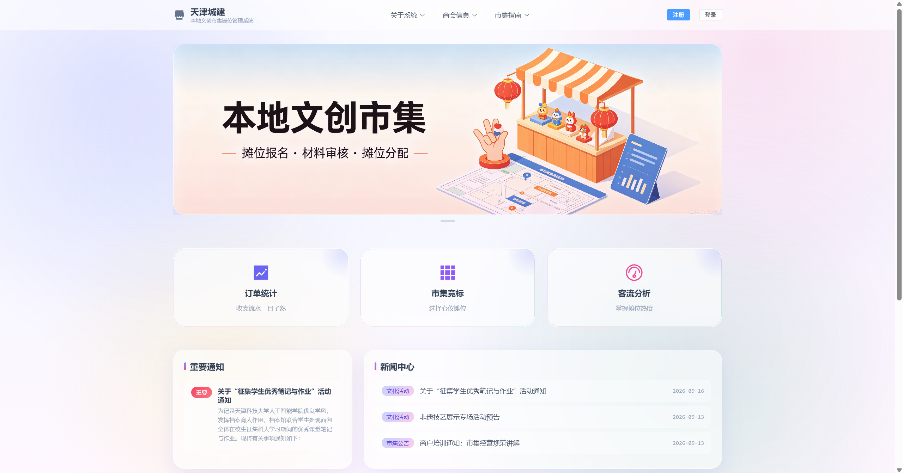
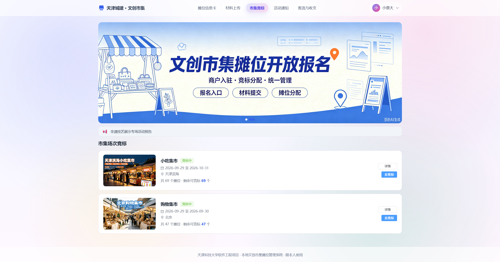
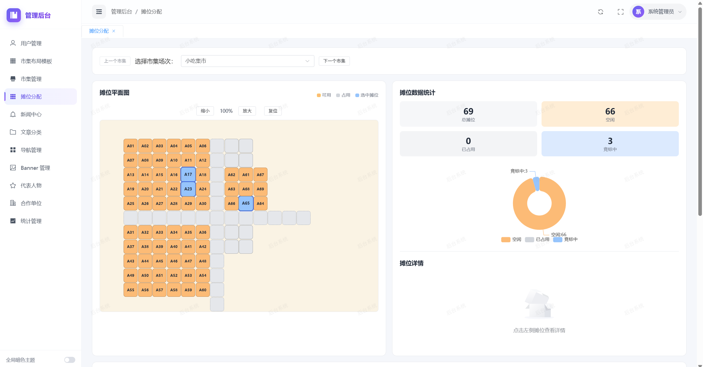

# 本地文创市集摊位管理系统
> 项目名称：本地文创市集摊位管理系统
> 技术栈：SpringBoot + MyBatis-Plus + Vue3 + Element Plus + MySQL
> 版本：V6.0
> 项目定位：功能型独立网站，面向天津本地文创市集，实现摊主报名、摊位竞标分配、材料审核、活动发布、数据统计一体化管理平台

## 📖 项目简介
### 项目背景
本地文创经济发展势头良好，但缺少统一线上管理平台。商户零散分布，存在摊位占地管理混乱、商品价值不透明、文化宣传缺少标准化流程等痛点，管理部门缺少系统化数字化工具。
本系统为小型线下文创市集活动提供一站式管理平台，分为**商户操作端**和**管理员后台**，实现商户报名、材料上传评审、摊位竞标分配、活动发布、客流&订单统计全业务闭环。

### 收益预估
- **商户收益**：商户在线竞标官方市集摊位，多摊位可选；系统自动统计流水、客流数据，支持生成收款付款链接。
- **业务收益**：解决商户零散经营、摊位占地混乱、商品信息不透明等问题，形成「报名→材料审核→摊位分配→数据统计」完整业务闭环，高效管理文创市集。
- **不做风险**：摊位分配由文创创新度、文化宣传价值、价格亲民度综合评审；商户提交材料需要管理员人工评审，评审结果无法对外自动产生商业价值。

## 📋 版本管理
| 版本号  | 日期 | 修订人 | 修订内容 |
|------| ---- |-----| ---- |
| V6.0 | 2026/09/13 | 小蔡  | 初稿 |

# 本地文创市集摊位管理系统

> 项目分为**后端仓库**与**前端仓库**两部分开发
- 前端仓库（当前仓库）
- <a href="https://github.com/Xiaocaidada/-PRD" target="_blank">👉 后端仓库 </a>
### 案例展示
> 目标上线版本：V6.0
> 本期开发范围：摊主报名、摊位分配、市集订单管理、后台客流统计、活动发布
> 后续迭代规划：电子证书制作、商品收录管理、AI综合数据分析报表

## 🧩 系统依赖
1. 文件存储：商户上传营业执照、文创材料等附件，存储于服务端，管理员支持在线预览、下载
2. 数据库：MySQL，存储商户信息、摊位、活动、订单、审核记录
3. 前端：Vue3 + Element Plus，响应式PC+移动端适配
4. 后端：SpringBoot + MyBatis-Plus
5. 短信服务：用于注册短信验证码

## ✅ 功能清单总览
| 功能编号 | 功能名称 | 端侧 | 优先级 | 功能简述 |
| ---- | ---- | ---- | ---- | ---- |
| 5.1 | 说明页（Landing Page） | 商户端 | P0 | 系统介绍，注册/登录入口 |
| 5.2 | 注册 / 登录 | 商户端 | P0 | 商户账号注册、登录、登录态维持 |
| 5.3 | 商户摊位信息卡 | 商户端 | P0 | 商户基础信息、摊位位置可视化展示 |
| 5.4 | 补充材料上传 | 商户端 | P0 | 文创商品、价格、竞标摊位材料上传提交审核 |
| 5.7 | 市集订单与付款链接 | 商户端 | P0 | 收支流水统计、收款链接生成 |
| 5.6 | 客流统计 | 商户端 | P1 | 商户摊位客流数据可视化展示 |
| 5.5 | 活动通知 | 商户端 | P1 | 查看市集最新活动公告 |
| 5.8 | 用户列表与筛选 | 管理员端 | P0 | 商户列表，支持姓名/证件号/状态多维筛选 |
| 5.9 | 用户详情与材料审核 | 管理员端 | P0 | 查看商户材料，审核通过/驳回 |
| 5.10 | 商户摊位信息卡编辑 | 管理员端 | P0 | 编辑商户信息卡，数据同步商户端 |
| 5.11 | 摊位分配 | 管理员端 | P0 | 参考商户竞标意愿分配摊位，处理摊位冲突 |
| 5.12 | 新闻中心-活动发布 | 管理员端 | P1 | 活动发布、编辑、下线管理 |
| 5.13 | 统计管理 | 管理员端 | P1 | 人流、市集订单统计，数据同步商户端 |

---

## 🖥️ 商户端详细功能说明
### 5.1 说明页（Landing Page）
> P0 核心页面，系统入口页面
#### 5.1.1 静态展示内容
- 机构标识：页面顶部展示【天津工商管理协会】、【天津城建】官方标识
- 标题：系统名称+Logo，注册/登录入口
- 正文：市集活动介绍、报名引导说明

#### 5.1.2 交互行为
1. 访问页面后，弹窗居中展示；**页面停留满5秒，注册/登录按钮解除置灰，允许点击**
2. 未注册用户点击【注册】进入注册表单；已注册用户点击【登录】进入登录页
3. 页面文案、活动内容全部由管理员后台维护，修改后实时生效

#### 5.1.3 页面适配
- PC端、移动端弹窗居中展示；响应式断点 `768px`

#### 异常处理
页面加载失败，展示错误提示+【刷新重试】按钮；入口组件异常不影响静态说明内容展示。

### 5.2 商户注册
> 商户首次入驻账号注册，**营业执照号作为账号唯一标识**
#### 5.2.1 注册表单字段（全部必填，标记选填除外）
- 商户负责人姓名：文本输入，和证件信息保持一致
- 商品品类：多选下拉，选项：食品、出版物、日用品、服装、酒类
- 营业执照号码：唯一标识，用于登录识别
- 手机号码：11位数字，附带【获取验证码】按钮
- 短信验证码：6位数字
- 电子邮箱：选填，接收系统通知邮件
- 设置密码：≥8位字符
- 确认密码：必须和密码完全一致

#### 5.2.2 注册业务逻辑
1. 前端校验：必填项非空、两次密码一致、密码长度≥8位
2. 校验通过后入库，账号状态标记为「合格商家」
3. 注册成功自动登录，跳转至商户摊位信息卡页面

#### 5.2.3 异常提示
- 证件号已注册：`该证件号已注册，请直接登录`
- 手机号已被占用：`该手机号已绑定其他账号`
- 验证码错误/过期：`验证码错误，请重新获取`
- 短信发送失败：`验证码发送失败，请稍后重试`，按钮恢复可点击

### 5.3 商户登录
#### 5.3.1 登录表单
- 账号：营业执照号码 / 负责人手机号 二选一均可登录
- 密码：首次登录默认密码为证件号后6位
- 图形验证码：4位字母数字，点击刷新

#### 5.3.2 登录逻辑
校验成功，跳转商户摊位信息卡；使用Token维持登录态，关闭浏览器后需重新登录。

#### 5.3.3 异常规则
- 账号不存在：`账号不存在，请先注册`
- 密码错误：`密码错误`
- 验证码错误：自动刷新验证码
- **连续5次密码错误 → 账号锁定15分钟**，提示`账号已临时锁定，请15分钟后重试`

### 5.4 商户摊位信息卡（商户核心主页）
登录后首页，展示商户全部基础信息、摊位竞标信息、审核状态。
#### 5.4.1 卡片模块结构
1. **基本信息模块**
    - 营业执照照片、负责人信息、证件号、入库时间、系统编号
    - 证件号、系统编号**默认掩码隐藏**，点击眼睛图标切换明文/掩码
2. **申请经营品类**：展示注册时选择的品类标签，附带相关法规说明
3. **竞标书模块（60%宽度）**
    - 商品货源、文创内容、生产标准，管理员审核通过后方可展示
4. **摊位简图模块（40%宽度）**
    - 市集摊位平面图，商户已竞标摊位标绿展示
5. **底部说明**：项目简介 + 使用须知

#### 5.4.2 空态与异常
- 材料审核中：模块提示 `材料审核中，审核通过后展示`
- 数据同步失败：展示上一次成功快照，顶部轻提示`数据同步失败，展示上次同步结果`
- 加载失败：展示错误提示+重试按钮

#### 5.4.3 适配规则
PC双栏布局，768px断点自动切换移动端单栏布局，卡片样式保持竖版。

### 5.5 补充材料上传
> 在摊位信息卡底部，商户提交竞标材料给管理员评审
1. 4个独立上传模块：商品货源、文创内容、生产标准、文创市集摊位
2. 每条提交包含：**必填文本描述 + 可选附件**
    - 附件支持：PDF、JPG、JPEG、PNG、DOC、DOCX，**单文件上限10MB**
3. 条目限制：每个模块最多同时存在5条条目，满5条后「添加条目」置灰
4. 提交后状态：待审核，提交后不可编辑；管理员审核通过后释放额度，可继续新增材料

#### 异常
- 文件超大小：`文件大小不能超过10MB`
- 文件格式不支持：过滤文件并提示不支持格式
- 文本为空：提交拦截，提示填写文字描述

### 5.6 全局顶部导航栏
- 吸顶悬浮导航，全站通用路由
- 左侧：Logo+天津城建标识；中间：动态一级/二级菜单；右侧：用户登录状态
- 未登录：展示「登录 | 注册」；已登录：头像（姓氏首字母）+ 用户名下拉菜单
- 滚动交互：页面滚动，导航由毛玻璃半透切换为纯白底色，增加阴影

### 5.7 Banner轮播模块
导航下方首屏大图，3:1固定比例圆角卡片
- 自动轮播5秒，手动切换重置计时
- 加载失败：展示品牌骨架占位图
- 无活动：空态文字 `暂无活动通知`

### 5.8 核心业务入口卡片
三个功能卡片：订单统计、市集竞标、客流分析
- 悬停交互：卡片上浮4px，扩大投影+品牌蓝光晕，图标放大

### 5.9 动态新闻/通知中心
左侧焦点图展示重要通知；右侧新闻列表，标题单行截断，带标签、发布日期。

### 5.10 文化合作单位生态模块
- 创意代表人物：圆形头像，自动折行
- 合作单位卡片：分三类【学术指导单位、学校科普单位、产学研单位】，hover文字变色

> 5.11 客流统计、5.12收支统计与付款链接：**V1.0本期暂不开发，预留接口，后续迭代实现**

---

## ⚙️ 管理员后台功能说明
### 5.13 后台顶部导航栏管理
- 支持动态配置一级、二级菜单，无需改代码
- 仅支持两级菜单；序号重复自动顺延排序；删除父菜单同步删除子菜单

### 5.14 Banner管理
- 强制图片裁剪比例 3:1，未裁剪无法保存
- 支持上架/隐藏切换，控制前端页面渲染

### 5.15 用户列表
- 字段：商户名称、联系人、证件号、审核状态、注册时间、操作入口
- 筛选：姓名模糊搜索、证件号精确搜索、审核状态筛选，支持组合筛选
- 分页：默认每页20条
- 无结果展示空态；接口异常展示重试按钮

### 5.16 创意创新代表人物管理
图片强制1:1裁剪（适配前端圆形头像），配置字段：姓名、头衔、序号、展示开关。

### 5.17 合作单位管理
字段：单位名称(必填)、分类(必填)、序号(必填)、跳转链接(选填)、状态开关
分类枚举：学术指导单位、学校科普单位、产学研单位
序号冲突自动顺延排序，链接为空时文字不可点击。

### 5.18 文章分类管理
- 字段：分类名称，「新闻中心固定展示」勾选框
- 勾选：分类作为前端新闻中心Tab；不勾选为独立页面，可配置URL给导航菜单
- 删除分类不删除文章，文章分类置空

### 5.19 用户详情 & 材料审核（P0核心）
1. 查看商户基础信息 + 所有上传附件，图片支持在线预览放大
2. 审核操作：**通过 / 驳回**
    - 通过：材料自动同步到商户摊位信息卡页面展示
    - 驳回：**必须填写驳回理由**，商户端可见驳回原因，可修改材料重新提交
3. 异常：驳回理由为空禁止提交，审核失败支持重试

### 5.20 商户摊位信息卡编辑
管理员可直接编辑商户信息卡内容，保存后实时同步商户端页面。
- 记录操作日志：编辑人、时间、修改内容，可查看历史记录
- 保存失败保留草稿，同步失败提供手动重试按钮

### 5.21 摊位分配（核心业务）
1. 分配优先级：优先分配商户竞标选择摊位；摊位冲突，按评审分数从高到低分配
2. 摊位互斥：同一个摊位同一时间只能分配给1个商户，已占用摊位平面图置灰不可选
3. 分配完成后，结果同步到商户摊位信息卡
4. 异常：摊位已占用，提示冲突，引导重新选择；分配失败自动回滚数据，提示重试

### 5.22 新闻中心-活动发布
- 字段：活动标题、活动时间、地点、详情、封面图、报名截止时间
- 操作：新增、编辑、下线、删除；仅下线状态活动允许删除
- 发布后实时同步到商户端活动通知模块
- 异常：活动时间冲突弹窗确认；图片上传失败可重试

### 5.23 统计管理
- 客流统计：按市集维度统计总客流、时段客流、单摊位客流
- 订单统计：按活动/商户维度统计订单数量、成交金额、退款金额
- 同步策略：默认每5分钟自动同步数据，支持管理员一键手动同步
- 报表导出：支持CSV / Excel导出
- 异常：同步失败记录日志，提供手动重试按钮；无数据展示空态

---

## 🎨 全局交互规范
1. **按钮**：hover加深10%，Loading状态置灰禁用
2. **弹窗**：中心缩放入场，背景毛玻璃遮罩
3. **Toast提示**：底部弹出，默认3秒自动消失，多消息覆盖
4. **前端校验**：必填项、图片比例、文件大小等**即时前端校验**，提前拦截非法提交

## 🧪 验收测试用例
| 序号 | 测试场景 | 前置条件 | 操作 | 期望结果 |
| ---- | ---- | ---- | ---- | ---- |
| 1 | 说明页正常加载 | - | 访问系统网址 | 页面Logo、声明正常渲染，注册登录按钮隐藏 |
| 2 | 说明页倒计时 | 页面打开 | 等待5秒 | 倒计时从5递减到0，按钮淡入可用 |
| 3 | 说明页服务守则弹窗 | 页面正常打开 | 点击查看守则 | 弹窗正常打开，点击遮罩关闭 |
| 4 | 注册正常流程 | 未注册商户 | 填写全部表单提交 | 注册成功自动登录，跳转摊位信息卡，入库成功 |
| 5 | 注册证件号重复 | 证件号已存在 | 提交注册 | 提示`该证件号已注册，请直接登录` |
| 6 | 注册两次密码不一致 | 填写不同密码 | 提交表单 | 前端拦截，提示两次密码不一致 |
| 7 | 登录正常流程 | 账号已注册 | 输入正确账号密码 | 登录成功，跳转摊位信息卡 |
| 8 | 登录密码错误 | 账号已注册 | 输入错误密码 | 提示密码错误，不跳转 |
| 9 | 密码连续5次错误 | 账号正常 | 连续输错密码 | 第6次提交被拦截，账号锁定15分钟 |
| 10 | 摊位信息卡基础信息展示 | 商户登录 | 进入主页 | 商户信息、掩码证件号正常展示 |
| 11 | 证件号显隐切换 | 信息卡页面 | 点击眼睛图标 | 明文/掩码切换，图标同步变化 |
| 13 | 材料上传选择文件 | 商户信息卡底部 | 选择多张图片 | 文件标签正常展示，支持删除 |
| 14 | 超大文件上传 | 打开上传组件 | 选择>10MB文件 | 拦截，提示文件不能超过10MB |
| 15 | 后台用户列表筛选 | 管理员登录 | 输入关键词搜索 | 表格只展示匹配商户 |
| 16 | 后台查看用户详情 | 用户列表 | 点击查看详情 | 完整展示商户信息+上传附件 |
| 17 | 后台审核通过 | 材料待审核 | 点击审核通过 | 状态变更，商户端页面同步更新内容 |
| 18 | 后台保存信息卡 | 打开商户编辑页 | 修改信息，点击保存 | 提示保存成功，数据持久化 |
| 19 | 移动端说明页适配 | 手机访问网址 | 打开页面 | 弹窗居中，布局正常不出界 |
| 20 | 移动端摊位信息卡 | 手机登录商户账号 | 打开主页 | 卡片单栏，字号适配，内容可读 |

## 📂 项目目录结构
